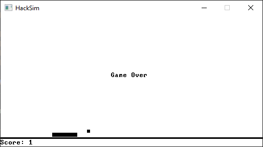

# HackSim

A deep hardware simulator for the Hack computer of Nand2Tetris.

# Technical Documentation

**If you want to learn more about how my hardware simulator works, read my [design document](HACKSIM-DESIGN-DOCUMENT.md)!**

# About

HackSim is a deep hardware simulator of my implementation of the Hack computer from [Nand2Tetris](https://www.nand2tetris.org/), an open-source educational project by Shimon Schocken and Noam Nisan. In the [Nand2Tetris course](https://www.coursera.org/learn/build-a-computer), students learn computer organization by designing logic gates, adders, memory, and more using only three primitive components: `Nand`, `DFF` (D flip-flop), and a clock. Students supply their implementations of hardware components in an HDL-like language, and Nand2Tetris provides an open-source Java-based [hardware simulator](https://www.nand2tetris.org/software) that simulates and tests the circuits implemented in HDL.

## Why Build Another Hardware Simulator?

The advantage of Nand2Tetris's hardware simulator is that it can accept any valid hardware configuration as input. The trade-off is that such a simulator is hard to optimize and is overwhelmed by the thousands of components in, say, a 4K RAM module. The authors of the Nand2Tetris hardware simulator subvert this problem by providing built-in simulations for large components like RAM modules. This modular design allows the hardware designer, while enjoying a significant simulation speedup, to test components in isolation.

Indeed, this is a practical solution, but a part of me really wanted to see all of the cogs I designed come together to create a living computer. I wondered if it was possible perform a deep simulation of _all_ of my hardware, all the way down to the NAND gates and flip-flops. It turns out that, with the help of a few optimizations, it was possible. This bizarre obsession of mine culminated in this C++ project, entitled _HackSim_.

# Getting Started

To get started, download the latest release from the GitHub page. Launch `hacksim-win32.exe` and choose a `.hack` file to run. A `.hack` file is a "binary" (0's and 1's in plain text) file consisting of a sequence of 16-bit instructions in the Hack computer instruction set. If you are familiar with the Nand2Tetris course, you can assemble your own Hack program with the assembler on the course website and run the generated `.hack` file with HackSim.

By default, HackSim will run as a deep hardware simulator, meaning that everything down to the NAND gates and flip-flops is being simulated. Naturally, this is resource-intensive and very slow, but even in this mode, it is still possible to demonstrate some of the Hack computer's capabilities. Examples that work well with the deep simulation mode include the programs in the `test_programs/asm/` directory.

Though the spirit of this project was to see my implementation of the Hack hardware come to life, you can also run HackSim as an optimized Hack computer emulator, much like the one provided by the instructors of Nand2Tetris. The optimizations can be turned on by editing the `hacksim.conf` text file that appears in the same directory as the executable. For full speed, set both optimizations to `true`. This allows you to play the classic Pong game, included in `test_programs/jack/`. You can also experiment with turning on only the CPU or memory optimization.

# Special Thanks

I would like to thank Shimon Schocken and Noam Nisan for creating the fountain of knowledge that is the Nand2Tetris course and for making all of its lessons and project materials open-source and available for free. It was a great pleasure to audit Parts 1 and 2 on Coursera, and I highly recommend both courses to any student of computer science, whether self-taught or university.

I would also like to give fellow Nand2Tetris enthusiast Ben Venutti (@benvenutti) a shout-out for making his [VM Translator](https://github.com/benvenutti/nand2tetris/tree/master/08%20-%20vm%202/vmTranslator) available. It includes crucial optimizations to generate a program that fits into the 32K ROM. I used it to generate all of the ROMs in `test_programs/jack/`. I compiled the VM Translator for Linux and put a copy in `tools/bvvm` for convenience.